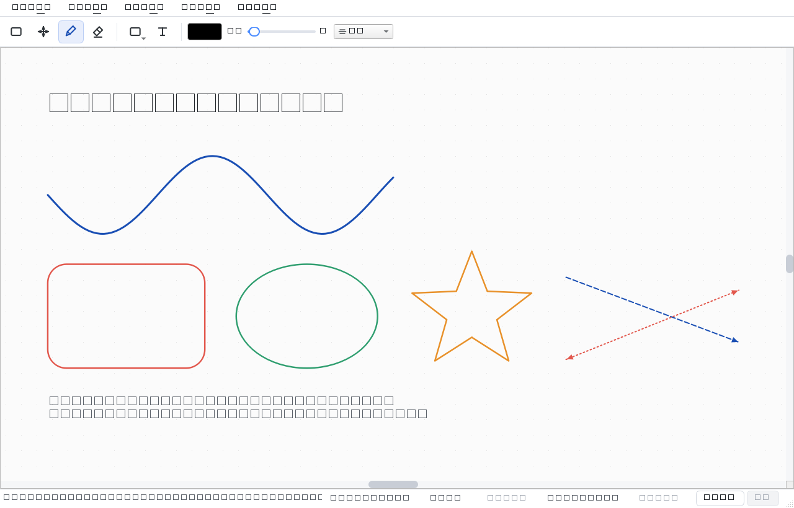
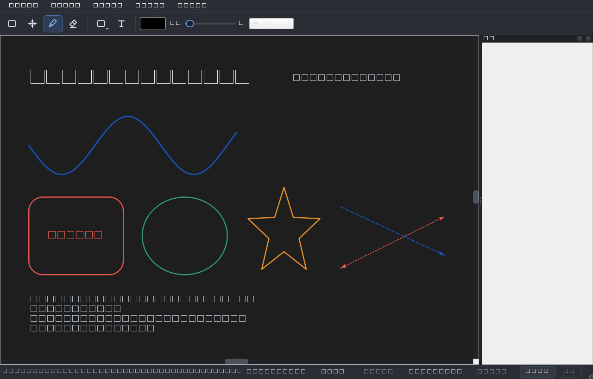

# 我的白板 · Whiteboard

> 一个用 **PySide6 / Qt Graphics View** 写的 Windows 桌面白板：手绘笔迹、擦断式橡皮擦、
> 形状与文字、框选移动、多页面、撤销重做、`.wbd` 文档、PNG 导出、深浅主题。
> 免安装、**配置写在程序目录里**（便携模式），删掉文件夹即彻底清理。

<p>
  
  
  
  
</p>



<details>
<summary>深色主题</summary>



</details>

---

## 功能特性

| 分类 | 说明 |
|------|------|
| **画笔** | 自由手绘，中点二次贝塞尔平滑；采样阈值按屏幕像素计算，缩放后手感一致 |
| **橡皮擦** | 真正的**擦断**：擦中间断成两段、擦两端变短、全覆盖才消失；光标处显示作用范围圆圈 |
| **形状** | 矩形 / 椭圆 / 直线 / 箭头，拖拽实时预览 |
| **文字** | 点击落点输入，选择工具双击可再编辑 |
| **选择 / 移动** | 点选、`Ctrl` 多选、空白处拖拽**框选**，拖动整体移动 |
| **拖动画布** | 工具栏「拖动」工具（四向箭头）左键直接平移；也支持空格+左键、中键拖拽 |
| **多页面** | 新建 / 删除 / 切换；每页独立场景与**独立撤销栈**（在第 2 页撤销不会改动第 1 页） |
| **撤销 / 重做** | 基于 `QUndoStack`；一次橡皮拖拽、一次批量删除都只算**一步** |
| **文件** | `.wbd` 为 UTF-8 JSON，可读可手改；原子写入（断电不损坏原文件） |
| **导出 / 导入** | 导出 PNG（按内容裁剪 + 2 倍超采样，不含选中框与网格）；导入图片 |
| **自动保存** | 默认每 60 秒写入 `autosave.wbd`，异常退出后下次启动可恢复 |
| **主题** | 浅色 / 深色一键切换，图标与画布背景同步重绘 |
| **便携** | 配置与自动备份都在程序目录，**不写注册表**；删目录即彻底清理 |

---

## 下载安装

### 方式一：下载发布包（普通用户）

1. 打开本仓库的 **Releases** 页面，下载最新版压缩包，例如
   `Whiteboard-1.0.0-win64.zip`；
2. 解压到**任意可写目录**（不要放 `C:\Program Files\` 这类需要管理员权限的位置）；
3. 双击 `Whiteboard.exe` 即可，无需安装 Python。

这是免安装的便携版：配置写在同目录的 `whiteboard.ini`，卸载 = 删除整个文件夹。
启动后如需确认配置位置，可在命令行执行 `Whiteboard.exe --paths`。

> 系统要求：Windows 10 / 11 64 位。

### 方式二：从源码运行（开发者）

```powershell
git clone https://github.com/leye123/whiteboardPerson.git
cd whiteboardPerson

python -m venv .venv
.\.venv\Scripts\Activate.ps1          # CMD 用 .venv\Scripts\activate.bat
python -m pip install -r requirements.txt

python main.py                        # 启动
```

* Python **3.9+**（开发环境为 3.10.19）；
* 依赖只有 **PySide6**（`requirements.txt` 里要求 `>=6.5`，实测 6.11.2）；
* 一定用 `python -m pip` 而不是裸 `pip`：若当前环境没有 `pip.exe`，
  裸 `pip` 可能落到系统里另一个 Python 上，装错地方。用 `pip --version`
  确认它指向你的虚拟环境；
* 网络受限时可用随附的离线安装脚本（自带断点续传与国内镜像）：

  ```powershell
  python scripts/install_wheels.py
  ```

---

## 使用说明

| 操作 | 方式 |
|------|------|
| 切换工具 | 工具栏按钮（悬停有提示），或「编辑」菜单 |
| 拖动画布 | ① 工具栏「拖动」工具 + 左键拖拽；② 按住 `空格` + 左键拖拽；③ 中键拖拽 |
| 橡皮擦 | 直接拖过要擦掉的部分（擦断）；范围随「粗细」滑块变化 |
| 框选 / 多选 | 选择工具：点击选中、`Ctrl` 点击多选、空白处拖拽框选 |
| 移动对象 | 选择工具拖动选中的对象；`Ctrl+Z` 可撤销 |
| 编辑文字 | 选择工具双击文字对象 |
| 缩放 | 鼠标滚轮（以光标为中心）、`+` / `-` |
| 视图 | `Ctrl+0` 适应窗口、`Ctrl+1` 实际大小 |
| 撤销 / 重做 | `Ctrl+Z` / `Ctrl+Y`（或 `Ctrl+Shift+Z`） |
| 删除 | 选中后按 `Delete`；`Ctrl+Shift+Backspace` 清空当前页 |
| 页面 | `Ctrl+T` 新建、`PgUp` / `PgDn` 切换、`Ctrl+Shift+D` 删除当前页 |
| 文件 | `Ctrl+N` 新建、`Ctrl+O` 打开、`Ctrl+S` 保存、`Ctrl+Shift+S` 另存为 |
| 导出 / 导入 | `Ctrl+E` 导出 PNG、`Ctrl+I` 导入图片 |
| 恢复默认设置 | 「视图 → 恢复默认设置…」（清掉颜色/粗细/工具/主题等偏好，画布内容不动） |

---

## 文件与配置

### 文档格式 `.wbd`

UTF-8 JSON，可读、可手工编辑、可纳入版本管理：

```json
{
  "app": "whiteboard-pyside",
  "version": 1,
  "current_page": 0,
  "pages": [
    {"name": "页面 1", "items": [
      {"type": "stroke", "color": [0,0,0,255], "thickness": 2.0,
       "points": [[100.0, 200.0], [104.0, 208.0]], "pos": [0.0, 0.0]}
    ]}
  ]
}
```

### 配置存放位置

偏好设置写在**程序目录**下的 `whiteboard.ini`（**不写注册表**）：

```
Whiteboard.exe
whiteboard.ini      ← 颜色 / 粗细 / 当前工具 / 主题 / 窗口位置
autosave.wbd        ← 自动备份
```

* 程序目录不可写（如装在 `Program Files`、只读 U 盘）时，自动退回系统应用数据目录，
  启动时状态栏会提示实际位置；
* 可用环境变量显式指定：
  * `WHITEBOARD_CONFIG` —— 配置文件路径；
  * `WHITEBOARD_DATA_DIR` —— 数据目录（自动备份放这里）；
* 想彻底清理：直接删文件夹即可；历史遗留（旧版注册表项、旧版 AppData 目录）用
  `python scripts/cleanup.py` 处理。

---

## 项目结构

```
whiteboard/
├── main.py              # 入口（--paths 打印配置位置）
├── main_window.py       # 主窗口：菜单/工具栏/状态栏/多页面/自动保存/主题
├── canvas/              # scene（点阵背景、命中查询）/ view（事件路由、缩放平移、叠加层）/ items
├── tools/               # 工具（策略模式）：选择、拖动、画笔、橡皮、形状、文字
├── core/                # stroke / page / history / settings / paths / version
├── persistence/         # .wbd 序列化与原子读写
├── widgets/             # 图标（运行时绘制）、取色按钮、粗细滑块、页面切换器
├── resources/styles/    # 浅色 / 深色 QSS
├── scripts/             # 图标自检、截图、离线安装依赖等开发辅助脚本
├── tests/               # 单元测试 + 端到端冒烟测试
└── docs/                # 截图与图标总览
```

---

## 开发与测试

```powershell
python tests\test_core.py     # 22 项核心逻辑单元测试（无需 pytest）
python tests\smoke_test.py    # 60 项端到端冒烟测试（offscreen，无需显示器）
python scripts\check_icons.py # 图标自检：贴边裁切、空白、工具栏溢出、控件被拉伸
```

两个测试脚本都自动使用 `QT_QPA_PLATFORM=offscreen`，退出码 0 表示全部通过；
测试通过 `WHITEBOARD_CONFIG` / `WHITEBOARD_DATA_DIR` 完全隔离，不会碰你的真实配置。

---

## 已知限制

* 选择工具支持移动，暂未提供缩放 / 旋转控制点；
* 矩形 / 椭圆 / 直线 / 文字 / 图片无法「擦断」，被橡皮碰到时整体删除；
* 画布范围为 20000 × 20000 的近似无限画布，超出该范围的内容不参与渲染。

## 许可证

尚未指定开源许可证。若需开源请补充 `LICENSE`（例如 MIT）；在补充之前默认保留所有权利。
