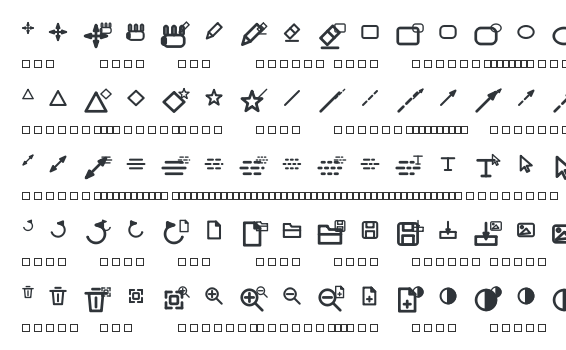

# 我的白板 (Whiteboard) — PySide6

基于 **PySide6 / Qt Graphics View Framework** 的 Windows 个人白板应用。
自由画笔（平滑曲线）、橡皮擦（擦断笔迹）、形状、文字、选择/移动（含框选）、
多页面、撤销重做、`.wbd` 文件保存、PNG 导出、自动保存与深浅主题。


<details>
<summary>深色主题预览</summary>


</details>

---

## 1. 环境与安装

要求 **Python 3.9+**（开发验证环境为 Python 3.10 + PySide6 6.11.2）。

```bash
# 1) 创建虚拟环境（当前目录构建，不污染系统环境）
python -m venv .venv

# 2) 安装依赖
python -m pip install -r requirements.txt
```

### 激活虚拟环境

仓库里已经带了一个可用的 `.venv`（Python 3.10.19 + PySide6 6.11.2），三种方式任选：

```powershell
# PowerShell
.\.venv\Scripts\Activate.ps1
```

```bat
:: CMD / 批处理
.venv\Scripts\activate.bat
```

```bash
# Git Bash / MSYS
source .venv/Scripts/activate
```

激活后提示符前会出现 `(.venv)`，`python` 会指向 `.venv\Scripts\python.exe`：

```powershell
python -c "import sys, PySide6; print(sys.prefix, PySide6.__version__)"
# G:\code\python\whiteboard\.venv 6.11.2
python main.py          # 启动白板
deactivate              # 退出虚拟环境
```

**不想激活也可以**（脚本、定时任务里更省事，也是本项目所有测试/工具的做法）：

```powershell
.\.venv\Scripts\python.exe main.py
.\.venv\Scripts\python.exe tests\smoke_test.py
```

> 若 PowerShell 提示「禁止运行脚本」（`UnauthorizedAccess`），只对当前窗口放开即可：
> `Set-ExecutionPolicy -Scope Process -ExecutionPolicy Bypass -Force`，
> 或改用上面的 `activate.bat`。

如果所在网络无法用 pip 正常下载（例如临时目录被安全策略限制、下载中断），
可以用随附的离线安装脚本：它会用 `urllib` 下载 wheel 并直接解压到
site-packages，支持断点续传与国内镜像。

```bash
python scripts/install_wheels.py            # 自动选版本（镜像优先，官方兜底）
python scripts/install_wheels.py --version 6.11.2
```

## 2. 运行

```bash
python main.py                 # 启动空白白板
python main.py 我的笔记.wbd     # 启动并打开文件
```

## 3. 项目结构

```
whiteboard/
├── main.py                  # 程序入口（QApplication、命令行打开文件）
├── main_window.py           # 主窗口：菜单/工具栏/状态栏/多页面/自动保存/主题
├── build_exe.py             # 打包脚本（PyInstaller 或 Nuitka）
├── canvas/                  # 画布
│   ├── scene.py             # WhiteboardScene：点阵背景、选中框、命中查询、图形项生命周期
│   ├── view.py              # WhiteboardView：事件路由、滚轮缩放、中键/空格平移
│   └── items.py             # 可持久化图形项（笔画/矩形/椭圆/直线箭头/文字/图片）
├── tools/                   # 工具系统（策略模式，统一事件接口）
│   ├── base_tool.py         # 工具基类
│   ├── pan_tool.py          # 拖动画布（左键拖拽平移，等价于空格/中键）
│   ├── pen_tool.py          # 画笔（中点二次贝塞尔平滑，按屏幕像素采样）
│   ├── eraser_tool.py       # 橡皮擦（一次拖拽 = 一个撤销步骤）
│   ├── shape_tool.py        # 矩形/椭圆/直线/箭头（拖拽预览）
│   ├── text_tool.py         # 文字（弹窗输入）
│   └── selector_tool.py     # 选择/移动（框选、Ctrl 多选、整体拖动）
├── core/                    # 核心数据与逻辑
│   ├── stroke.py            # 笔画模型 + 平滑曲线 + 颜色序列化工具
│   ├── page.py              # 页面（一页 = 一个独立场景 + 独立撤销栈）
│   ├── history.py           # QUndoCommand / QUndoStack 撤销重做
│   ├── paths.py             # 程序/数据文件位置（便携模式、只读目录兜底）
│   ├── settings.py          # 偏好设置（whiteboard.ini，不写注册表）
│   └── version.py           # 版本号唯一来源（窗口标题/关于/产物名/标签）
├── persistence/
│   ├── serializer.py        # 文档 <-> JSON dict（.wbd 格式）
│   └── file_handler.py      # 原子写入、自动保存路径
├── widgets/
│   ├── icons.py             # 运行时绘制的矢量图标（随主题重着色）
│   ├── color_picker.py      # 取色按钮
│   ├── thickness_slider.py  # 粗细滑块
│   └── page_navigator.py    # 页面切换器
├── resources/
│   ├── icons/README.md      # 自定义图标的替换说明
│   └── styles/              # 浅色/深色 QSS
├── scripts/
│   ├── install_wheels.py    # 离线/受限网络下的依赖安装
│   ├── release.py           # 打包 + 生成发布资产 + 创建 GitHub Release
│   ├── cleanup.py           # 清理注册表偏好 / 自动备份（卸载、搬家时用）
│   ├── screenshot.py        # 把主窗口渲染成 PNG（文档配图 / 视觉检查）
│   ├── check_icons.py       # 图标自检：贴边裁切/空白/被拉伸 + 生成总览图
│   └── icon_ascii.py        # 在终端用 ASCII 点阵“看”图标（排查线条断裂）
├── tests/
│   ├── test_core.py         # 22 项核心逻辑单元测试（无需 pytest）
│   └── smoke_test.py        # 60 项端到端冒烟测试（offscreen，无需显示器）
└── docs/                    # 截图与图标总览图
```

## 4. 操作指南

| 操作 | 方式 |
|------|------|
| 工具切换 | 工具栏按钮或「编辑」菜单 |
| 拖动画布 | ① 工具栏「拖动」工具（四向箭头图标）：选中后左键拖拽即可；② 按住空格 + 左键拖拽；③ 中键拖拽 |
| 橡皮擦 | 拖动擦掉经过的**笔迹片段**（擦断，不是整条删除）；矩形/椭圆/直线/文字/图片被碰到时整体删除；光标处会显示作用范围圆圈，大小随「粗细」滑块调整 |
| 选择/移动 | 选择工具：点击选中、Ctrl 多选、空白处拖拽框选；拖动整体移动 |
| 编辑文字 | 选择工具双击文字对象 |
| 缩放 | 鼠标滚轮（以光标为中心）；`+`/`-`、`Ctrl+0` 适应窗口、`Ctrl+1` 实际大小 |
| 撤销/重做 | `Ctrl+Z` / `Ctrl+Y`（或 `Ctrl+Shift+Z`）；一次擦除拖拽 = 一个撤销步骤 |
| 删除 | 选择工具选中后按 `Delete` |
| 页面 | `Ctrl+T` 新建；`PgUp`/`PgDn` 切换；`Ctrl+Shift+D` 删除当前页 |
| 文件 | `Ctrl+S` 保存、`Ctrl+Shift+S` 另存为、`Ctrl+O` 打开、`Ctrl+E` 导出 PNG、`Ctrl+I` 导入图片 |
| 恢复默认设置 | 「视图 → 恢复默认设置…」（清掉颜色/粗细/工具/主题等偏好，画布内容不动） |

## 5. 实现要点

- **工具策略模式**：每个工具只需实现 `mousePressEvent/mouseMoveEvent/mouseReleaseEvent`
  等回调，`WhiteboardView` 负责把事件转发给当前工具；工具不持有场景引用，
  因此多页面切换时无需重建工具。平移手势只实现一份（视图的
  `begin_pan/do_pan/end_pan`），空格+左键、中键、以及「拖动」工具都复用它 ——
  「拖动」工具只需要在按下时调用 `begin_pan`，后续移动与收尾由视图接管。
- **橡皮擦（擦断算法）**：`core.stroke.split_by_eraser()` 把一条笔迹的采样点按
  「是否落在橡皮圆内」切成若干段 —— 擦中间就断成两条，擦两端就变短，全擦到才消失；
  剩余的段会重新生成 `StrokeItem`。整段拖拽通过
  `core.history.ReplaceItemsCommand` 合并成**一个**撤销步骤，
  且中途生成的碎片再次被擦到时不会污染撤销记录（见
  `test_eraser_gesture_bookkeeping`）。橡皮直径 = `粗细*2+8`（上限 48），
  以前的 `粗细*4+8` 在粗细拉满时会得到 64 像素的橡皮，点一下就能把整条笔迹吃掉。
- **撤销栈**：所有内容变更都封装成 `QUndoCommand`（新增/删除/批量删除/清空/移动/替换），
  一次拖拽擦除多个对象会合并成一个撤销步骤（`core.history.push_commands`）。
- **平滑笔迹**：采样点由 `core.stroke.build_path` 用「中点二次贝塞尔」拟合，
  采样阈值按屏幕像素计算，缩放后手感一致；序列化保存的是原始采样点，
  因此曲线拟合不会造成保存后丢点。
- **图形项生命周期**：`WhiteboardScene` 持有顶层图形项的 Python 引用。
  否则 `QUndoStack.clear()` 删掉撤销命令后，图形项会因引用计数归零被回收，
  表现为「删除页面后其它页内容也消失」。
- **网格自适应**：点阵网格步长随缩放自动切换档位，并限制单次绘制点数，
  避免缩到很小时一次重绘画几十万个点。
- **PNG 导出**：导出范围取「所有图形项外接矩形 + 24 边距」（而不是 20000×20000 的
  场景矩形），输出尺寸 = 该范围 × 2（2 倍超采样）。两个容易写错的地方：

  * `QGraphicsScene.render()` **自己**会把 `source` 映射到 `target`，
    目标矩形已经是 source 的 2 倍就等于做了超采样 —— 不能再
    `painter.scale(2, 2)`，否则缩放两次，只会导出左上角那一块
    （表现为「导出图片被裁掉一半」）；
  * 导出前要**临时取消选中**：`QGraphicsTextItem` 等对象在选中态会用高亮色绘制，
    不清掉的话导出图里会带上选中高亮；点阵网格也要临时隐藏。
    测试用「选中状态导出的图 == 无选中状态导出的图」逐像素比对来卡这一点。

### 5.1 图标（`widgets/icons.py`）

图标全部由 QPainter 在运行时绘制，因此会随主题重新着色、打包时不需要资源文件。
两个必须注意的坑：

1. **同一个 QIcon 里不要混入设置了 `devicePixelRatio` 的位图。**
   QIcon 只按“位图的设备尺寸”挑最接近的一张，而且永远不会向上放大。
   如果放入 20×20(DPR=1) 和 40×40(DPR=2) 两张，在 125% 缩放的屏幕上
   （按钮需要 30 设备像素）Qt 可能挑中 40×40 那张，其逻辑尺寸变成 32，
   于是图标在 24 像素的按钮里被画得又小又偏 —— 表现为「图标显示不全」。
   正确做法是准备**多个离散尺寸**（16/20/24/30/32/40/48/64），DPR 一律为 1。
2. **轮廓要闭合、坐标要留在安全区内。**
   `QPainter.drawPolygon` 不会自动闭合，笔、橡皮这类轮廓不闭合就会出现
   “线条少一段”；所有坐标限制在 2.2~17.8（20×20 坐标系内），
   给线宽和圆帽留余量，避免贴边被裁。

工具栏还有一个隐蔽问题：`QToolBar` 会拉伸最后加入的、允许变宽的控件，
导致「粗细」两个字留在左边、滑块被推到窗口最右边。`ThicknessSlider`
因此显式设置 `QSizePolicy.Fixed`。



### 5.2 四个 PySide6 / Graphics View 的坑（都会表现为「功能静默失效」）

1. **`QGraphicsScene.setSelectionArea(path, mode)` 必须用关键字传 `mode`。**
   PySide6 暴露了 `(path, deviceTransform)` 重载，位置参数传枚举会被解析成
   `QTransform` —— 轻则 `TypeError`，重则**段错误**。更麻烦的是这个异常发生在
   C++ 调用进来的事件处理函数里，会被直接吞掉，用户看到的就是「框选毫无反应」。
2. **`QGraphicsView(scene)` 构造不会调用 Python 覆盖的 `setScene()`。**
   初始场景必须自己连信号，否则首页收不到 `selectionChanged`；
   切页时则要断开旧场景再连新场景，不然会连到已经丢弃的页面上。
3. **画在 `drawForeground` / 视口叠加层上的东西，必须自己失效对应区域，而且缓存位置要能跟上。**
   选中虚线框不在任何图形项的包围盒里，Qt 的增量重绘（本视图用
   `BoundingRectViewportUpdate`）不会刷新它 —— 框选、取消选中、移动之后，
   上一次的虚线框会留在屏幕上，看起来「白板上多了一堆框」。

   这里踩过两个层次的坑：

   * 只监听 `selectionChanged` 还不够：缓存里存的是**移动前**的框位置，
     而框本身已经跟着图形项跑到新位置了，于是下一次失效重绘只刷新老位置，
     **新位置上的框永远擦不掉**（用户反馈的正是「移动之后第一个框选的符号还留着框」）。
     所以还要监听 `scene.changed`（`WhiteboardView._on_scene_changed`），
     在图形项移动/改形时刷新缓存并把「旧位置 ∪ 新位置」都标脏。
   * 顺便把选中框从 `scene.drawForeground` 挪到了**视口叠加层**
     （`WhiteboardView._draw_selection_boxes`）：这样绘制与失效用同一套视口坐标，
     而且选中框不会被 `scene.render()` 画进导出的 PNG
     （测试里用「选中状态导出的图 == 无选中状态导出的图」来卡这一点）。

   同类问题还有工具里临时加进场景的辅助图形项（框选矩形），
   必须保证在任何中断路径（切工具、手势被打断）上都被移除，
   否则会一直叠在白板上。
4. **测试不能靠 `QSettings.setDefaultFormat(IniFormat)` + `setPath()` 来隔离配置。**
   Qt 6 在 Windows 上对 `QSettings(org, app)` 仍然读写注册表（实测 `fileName()`
   依旧是 `HKEY_CURRENT_USER\...`），于是测试会把「粗细=40、当前工具=橡皮」
   写进用户的真实配置，再反过来污染后续测试。
   正解：`core.settings.AppSettings` 支持 `WHITEBOARD_CONFIG` 环境变量指向一个
   `.ini`，测试用它做隔离：

   ```python
   os.environ["WHITEBOARD_CONFIG"] = os.path.join(tmp_dir, "whiteboard.ini")
   ```

## 6. `.wbd` 文件格式

UTF-8 JSON 文本，可读、可手工编辑、可版本管理：

```json
{
  "app": "whiteboard-pyside",
  "version": 1,
  "current_page": 0,
  "pages": [
    {"name": "页面 1", "items": [
      {"type": "stroke", "color": [0,0,0,255], "thickness": 2.0,
       "points": [[100.0, 200.0], [104.0, 208.0]], "pos": [0.0, 0.0]}
    ]}
  ]
}
```

写入采用「临时文件 + `os.replace`」的原子方式，中途断电不会损坏原文件。
自动保存默认每 60 秒写入软件目录下的 `autosave.wbd`，下次启动会询问是否恢复。

### 配置存放位置（便携模式）

偏好设置默认写在**软件目录**下的 `whiteboard.ini`（源码运行 = 项目根目录，
打包后 = exe 所在目录），**不写注册表** —— 删掉目录就彻底干净了：

```ini
[style]
color=#ff000000
thickness=9

[tools]
current=pen

[window]
geometry=@ByteArray(...)
state=@ByteArray(...)

[app]
theme=light
```

* 软件目录**不可写**时（例如装在 `Program Files`、只读 U 盘），自动退回系统的
  应用数据目录，`core.paths.is_portable()` 可以查询当前落在哪种情况；
* 可用环境变量覆盖：`WHITEBOARD_CONFIG`（配置文件路径）、
  `WHITEBOARD_DATA_DIR`（数据目录，自动备份放这里）；
* 旧版本写在注册表里的偏好会在**首次运行新版时一次性迁移**到 ini 并清掉旧键
  （只搬一次：否则删掉 ini 想「恢复默认」时旧值会从注册表复活）。
  想回到出厂状态用「视图 → 恢复默认设置…」。

### 卸载 / 清理痕迹

便携模式下，**删掉软件目录就干净了**（`whiteboard.ini` 与 `autosave.wbd` 都在里面）。
随附脚本用于处理历史遗留（旧版注册表项、旧版 AppData 目录）：

```powershell
python scripts/cleanup.py --dry-run        # 先看看会删什么
python scripts/cleanup.py                  # 确认后清理
python scripts/cleanup.py --settings-only  # 只删配置，保留自动备份
python scripts/cleanup.py --legacy-only    # 只清旧版遗留（注册表 + 旧数据目录）
```

| 内容 | 位置 |
|------|------|
| 配置（当前版本）| 软件目录 `whiteboard.ini` |
| 自动备份 | 软件目录 `autosave.wbd` |
| 旧版注册表偏好（若存在）| `HKCU\Software\WhiteboardPyside\Whiteboard` |
| 旧版数据目录（若存在）| `%APPDATA%\WhiteboardPyside\{Whiteboard, 我的白板}` |

手动清理：`reg delete "HKCU\Software\WhiteboardPyside" /f`，
以及删掉 `%APPDATA%\WhiteboardPyside`。

## 7. 测试

```bash
# 核心逻辑单元测试（笔画/擦除切分/序列化/撤销命令/场景行为）
python tests/test_core.py            # 22/22

# 端到端冒烟测试：画笔→撤销→形状→橡皮擦断→框选→拖动→多页面→存取→导出 PNG→主题
python tests/smoke_test.py           # 60/60
```

两个脚本都会自动使用 `QT_QPA_PLATFORM=offscreen`，无需真实显示器，
退出码 0 表示全部通过。生成截图：

```bash
python scripts/screenshot.py --theme light
python scripts/screenshot.py --theme dark
```

### 图标自检

```bash
python scripts/check_icons.py            # 逐图标体检 + 工具栏实测 + 生成 docs/icons.png
set QT_SCALE_FACTOR=1.25 && python scripts/check_icons.py   # 模拟 125% 缩放屏
python scripts/icon_ascii.py 16 pen eraser                  # 终端里 ASCII 看图标
```

`check_icons.py` 会检查：图标是否空白、墨迹是否贴到画布边缘（贴边=被裁切）、
覆盖率是否过高（小尺寸糊成一团）、工具栏是否溢出（按钮被收进 “>>”）、
工具栏控件是否被异常拉伸。在 100%/125%/150% 缩放下都应退出码为 0。

## 8. 已知限制与后续可做

- 矩形 / 椭圆 / 直线 / 箭头 / 文字 / 图片无法「擦断」，被橡皮碰到时整体删除；
  笔迹已经支持按橡皮圆擦断（见第 5 节的切分算法）。
- 选择工具支持移动，暂未实现缩放/旋转控制点。
- 数位板压感可变线宽尚未实现（可在 `PenTool` 里读取 `QTabletEvent.pressure`，
  用「变宽填充多边形」渲染）。
- 场景范围固定为 20000×20000（近似无限画布），超出该范围的内容会被裁掉。
